# Project 1: Personal Website

The goal for this project was to create and deploy a personal website that showcases my technical abilities, houses a portfolio of projects, and serves as a way for others to connect with me. Below is my full process, from adapting a template to deploying the site on AWS.

**Live Site:** dylanhite.com

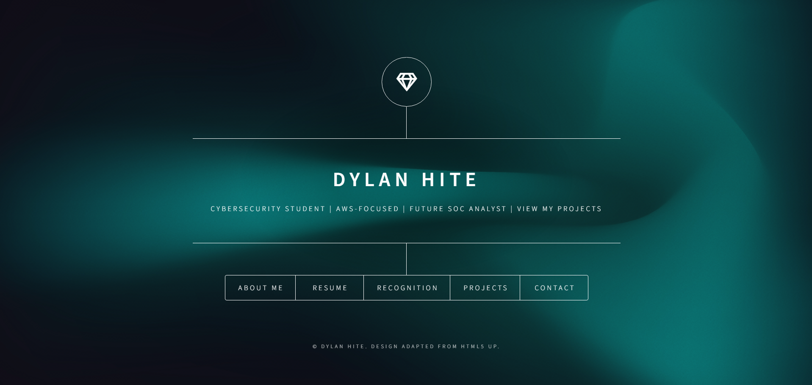
Finished homepage

---

## Template Selection & Initial Development

The first thing I did was find a template that I could adapt. I wanted something professional with good animations, and https://html5up.net/dimension was a perfect match. I downloaded the template and got to work.

The two files I used the most were:

* `index.html` → structure, text, and layout
* `main.css` → styling, positioning, and colors

Any changes to text or layout were done in `index.html`, while visual changes were handled in `main.css`.

The process was straightforward:

* Pick a section of the site
* Find the corresponding HTML block
* Replace it with my own content

This worked well for the **home** and **about** sections, but I had more customization in mind for the **resume** and **contact** sections.

At this stage, I was editing everything in Notepad (before switching to a proper editor later).

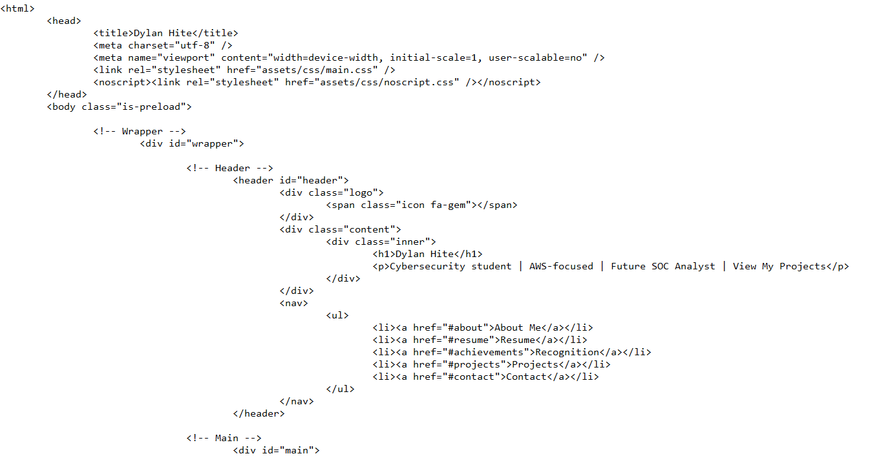

---

## Building the Site Structure

When adding images, I placed them in the `/images` folder and referenced them directly in HTML. My goal was to first get a fully working **static site**, before focusing heavily on styling.

At this point:

* Pages were simple (mostly text and lists)
* Minimal styling was applied
* Focus was on functionality first

---

## Expanding the Website

I decided to expand the site to include an additional page, bringing the total to six sections.

To do this, I added a navigation link:

```html
<li><a href="#achievements">Recognition</a></li>
```

Then I created a new `<article>` section in the HTML with the corresponding ID and content.

For larger or more complex code blocks, I co-created portions of the HTML/CSS using ChatGPT.

---

## Feature Enhancements

Once the base structure was complete, I started improving the site with more meaningful features:

* The **About page** includes a side panel with key highlights for quick scanning
* The **Resume page** includes a button to view/download my resume
* The **Recognition page** displays certification badges visually
* The **Projects section** uses a grid layout (planned to be fully clickable later)
* The **Contact page** includes working links to external platforms

Example of resume page implementation:

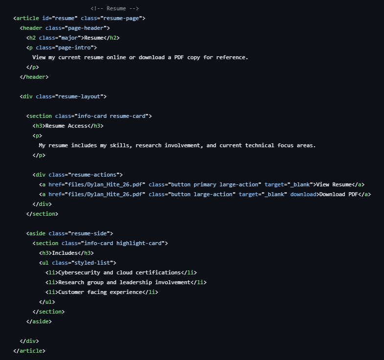

To support this, I stored my resume file in a `/files` directory:

```text
files/Dylan_Hite_26.pdf
```

---

## Styling & Visual Improvements

One of the more visually impactful sections was the **Recognition page**, where I displayed certification badges using custom styling.

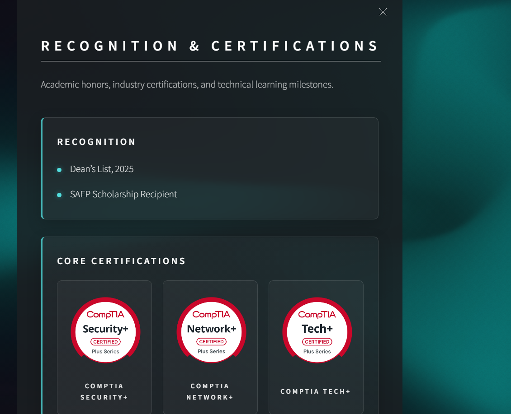
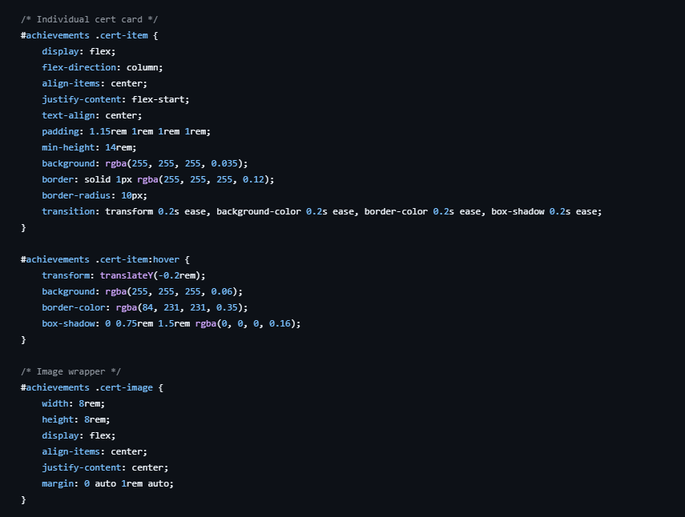

These changes required:

* Custom CSS layouts (grid/flexbox)
* Image formatting and spacing adjustments
* Consistent styling across sections

---

## Project File Structure

The main files for this project are located at:

```text
cloud/personal-website/site/index.html  
cloud/personal-website/site/assets/css/main.css
```

---

## 🚀 Deployment (AWS)

Once the site was complete locally, I deployed it using AWS.

### Step 1: S3 Static Hosting

* Created an S3 bucket
* Enabled **public access** (for static hosting)
* Uploaded all website files
* Enabled **static website hosting**
* Configured `index.html` as the entry point

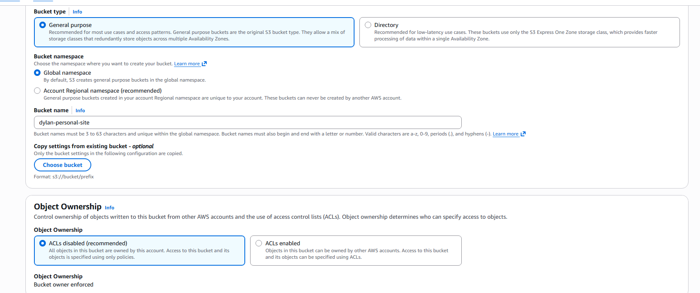
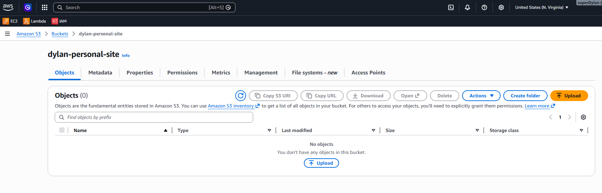
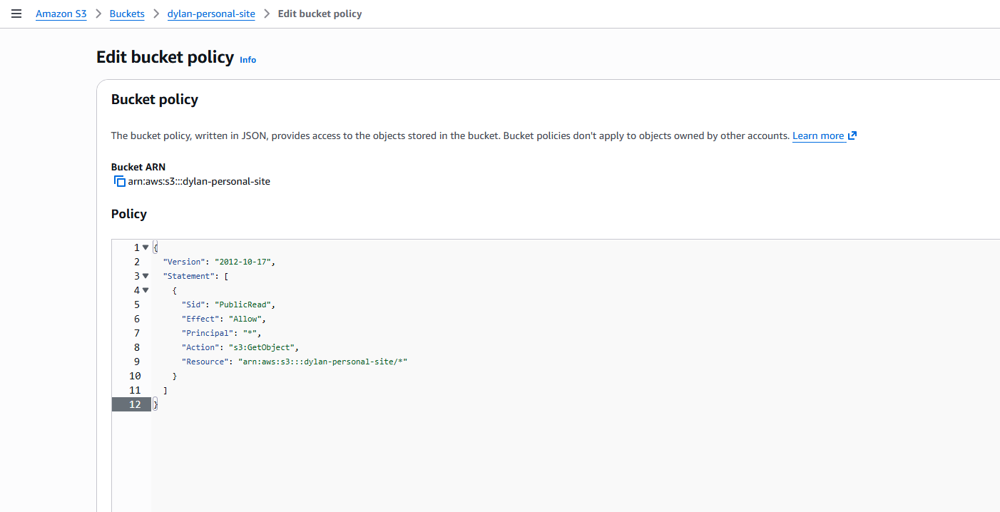

---

### Step 2: CloudFront + HTTPS + Domain

To improve the project and make it production-ready, I added:

* HTTPS encryption
* Custom domain
* Global content delivery

Steps taken:

* Created a **CloudFront distribution** linked to the S3 bucket
* Requested an SSL certificate using **AWS Certificate Manager (ACM)**
* Validated the certificate using **DNS validation in Route 53**
* Purchased a domain and configured DNS records
* Pointed the domain to the CloudFront distribution

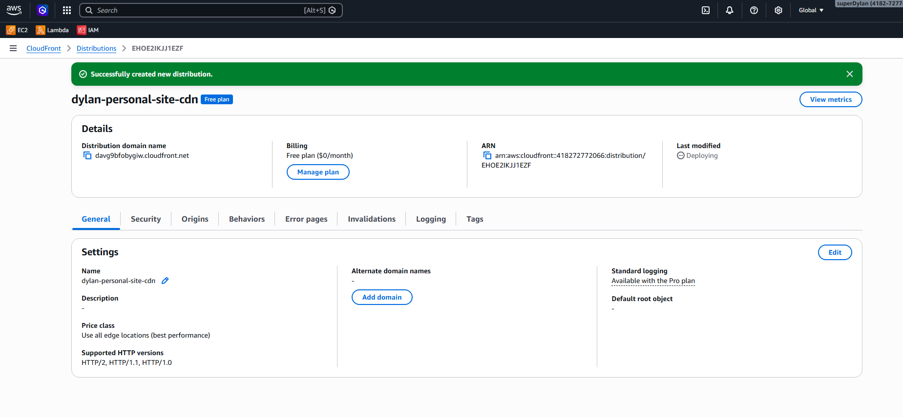
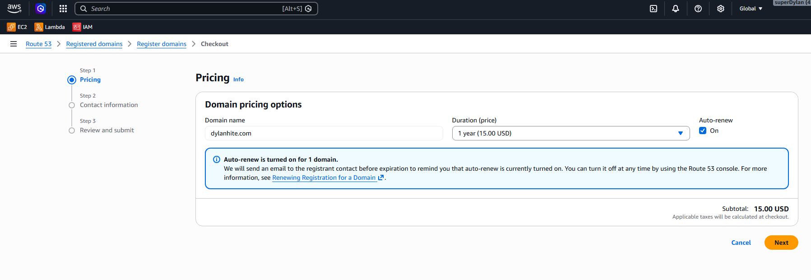

---

### Final Architecture

All components work together as follows:

* **S3** → stores and serves static website files
* **CloudFront** → caches and distributes content globally
* **ACM** → provides HTTPS encryption
* **Route 53** → routes domain traffic

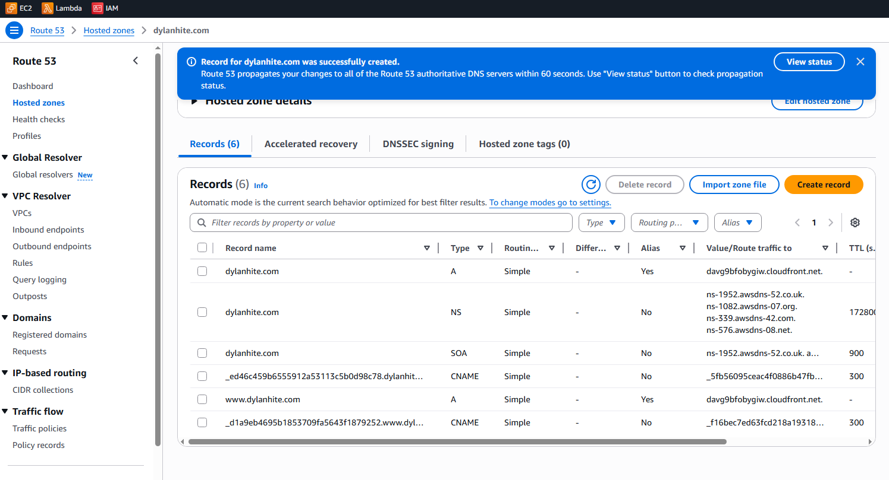

---

## Key Takeaways

* Building a static website requires strong understanding of HTML/CSS structure before styling
* Separating functionality (HTML) and design (CSS) makes development easier to manage
* AWS S3 + CloudFront is an effective way to deploy scalable static websites
* Adding HTTPS and a custom domain significantly improves professionalism and usability

---

## Future Improvements

* Make project cards fully interactive and clickable
* Improve mobile responsiveness
* Add backend functionality (forms, analytics, etc.)
* Transition development fully into a modern editor (VS Code)

---
