# MITRE CALDERA Lab

## Overview

The goal for this project is to emulate and observe adversary techniques using MITRE CALDERA. Below is a documentation of the setup, process, and aftermath.


### Documentation

This lab simulates attacker behavior using MITRE CALDERA and transitions into basic incident response analysis. The goal is to understand both offensive techniques and how they can be detected and investigated.

---

## Setup

Mitre caldera is highly compatible with the ubuntu linux distribution, so even though I already had a Kali linux box, to avoid issues later I downloaded an ubuntu iso and created another virtual box for use of this project. This will be the offensive server. I’ll be using a Windows 10 virtual box as the target. Some of the attacks can be destructive, so it’s better to not use any real devices as the targets. These two machines need to be on the same subnet to communicate with each other, so in virtual box, I made sure to configure their networks to a new Nat Network. If you know anything about setting up virtual boxes, you should know this part can sometimes be a pain, but luckily I ran into no issues during the whole setup process.

### Documentation

* Attacker: Ubuntu VM (CALDERA server)
* Target: Windows 10 VM
* Network: VirtualBox NAT Network (same subnet required for communication)
* Verified connectivity using:

  * `ip a` (Ubuntu)
  * `ipconfig` (Windows)

---

## Running CALDERA

On Ubuntu, I need to download caldera by cloning into the github repository and downloading the dependencies. In the terminal, I navigate to the caldera folder and start caldera by running:

```bash
python3 server.py --insecure
```

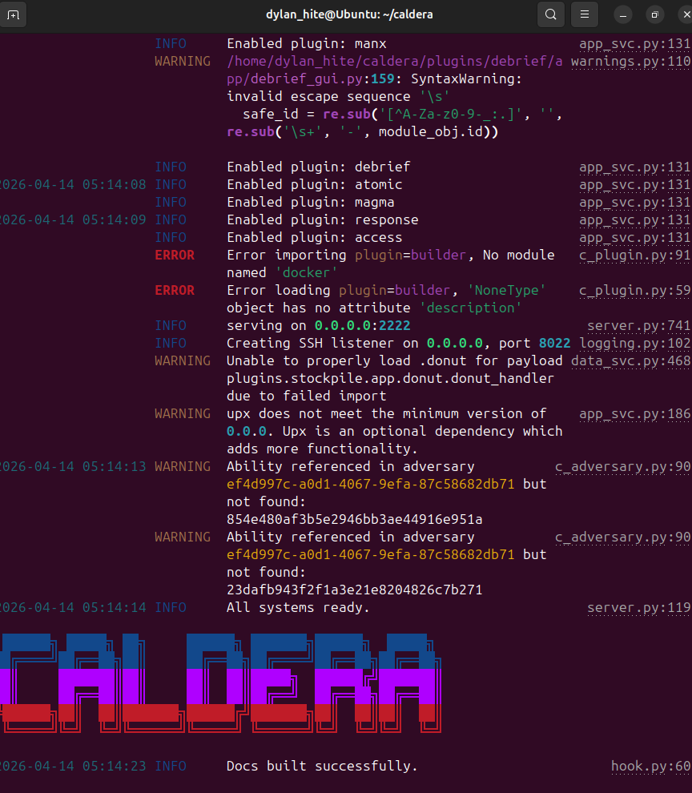

Its running!

Then in a browser, I navigate to:
http://10.0.2.3:8888

I login using the credentials:

* Username: red
* Password: admin

At this point I’ve made it to the interface where I can start deploying agents. We’re going to pause here and make some final changes to windows to make sure everything runs smoothly.

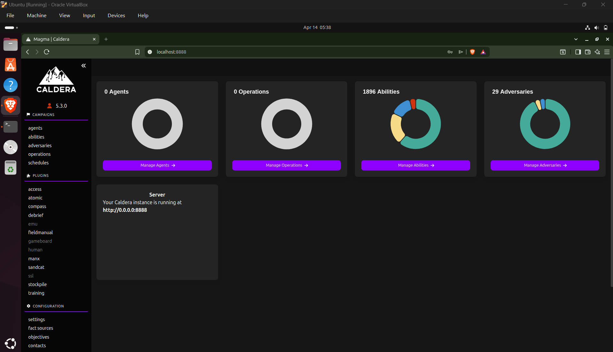

### Documentation

* CALDERA runs locally on port 8888
* The `--insecure` flag enables default credentials and simplifies setup for lab environments
* The web UI is used to deploy agents and execute adversary operations

---

## Preparing Windows

First it's important that we disable windows defender active threat protection, and change the execution permissions in powershell. Since this is the first run through, I’m focusing less on realism, and more on observing the process. With these changes, most/all of the payload objectives should be successful.

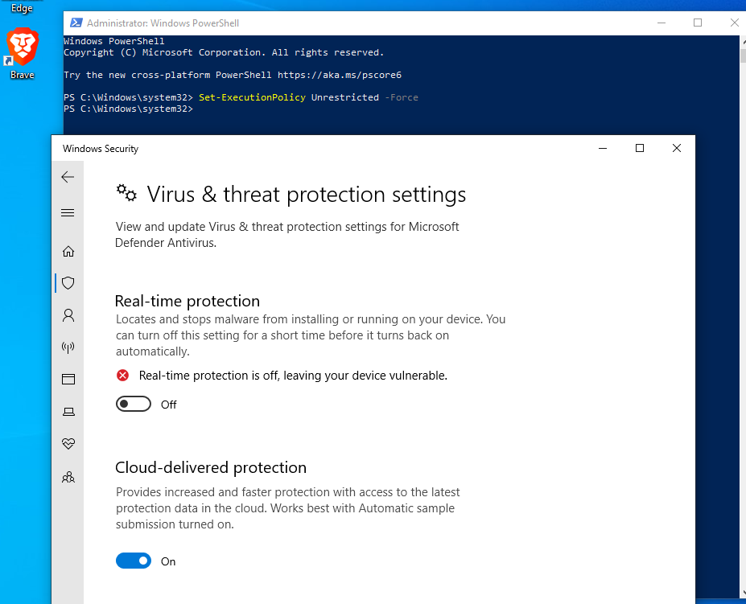

### Documentation

Commands used:

```powershell
Set-ExecutionPolicy Unrestricted
```

* Defender was disabled to prevent payload blocking
* This step is not realistic but helps ensure visibility during the lab

---

## Deploying the Agent

Now I just need to run `ip a` on ubuntu and `ipconfig` on windows to make sure they have the same subnet and the setup is all complete.

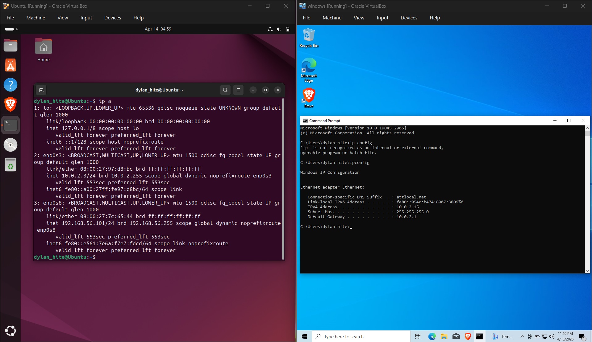

From here we move back to the Ubuntu box, and using the CALDERA UI click sandcat. Then in the sandcat page, it has three targets. We select the windows one and immediately we see the payload we’ll be using. I copy the payload and paste it in my windows terminal with no issues.

Normally, an agent wouldn’t be delivered this way unless there was an insider threat or something similar. How an attacker would deliver the payload would differ based on the scope and org, but in place you could imagine a phishing attack or something similar.

After waiting for a bit, the agent appears on the CALDERA UI. Now, we’re able to run an operation.

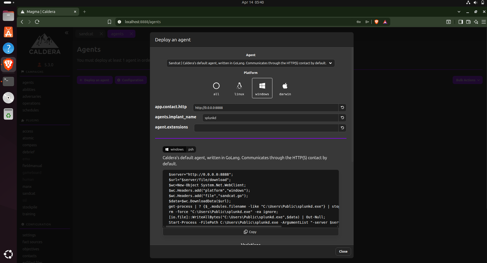

### Documentation

* Agent: Sandcat (default CALDERA agent)
* Communication: HTTP (port 8888)
* Execution method: manual PowerShell payload
* Agent appeared in CALDERA under group `red`

---

## Running the Attack

The adversary profiles range in abilities. For the purpose of this first lab, I want only a recon tool. Mostly because it’s harder to detect, and easier to cleanup afterwards. I don’t want to destroy my brand new windows box just yet.

So the profile I went with was **Nosy Neighbor**.

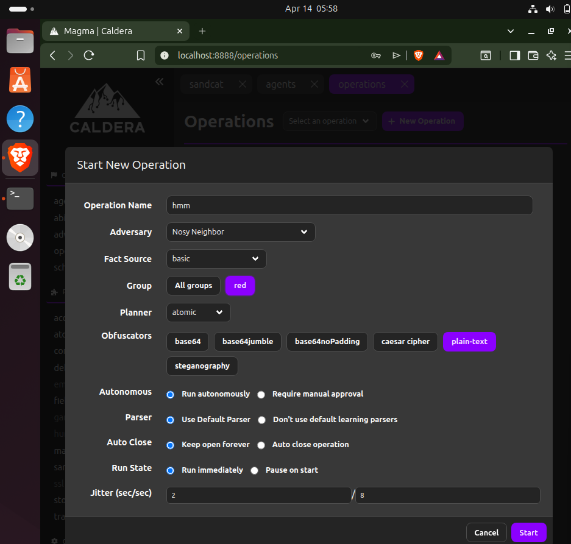

After running it, it takes a minute but will eventually return with all different outputs. Here’s the UI screen and an example output:

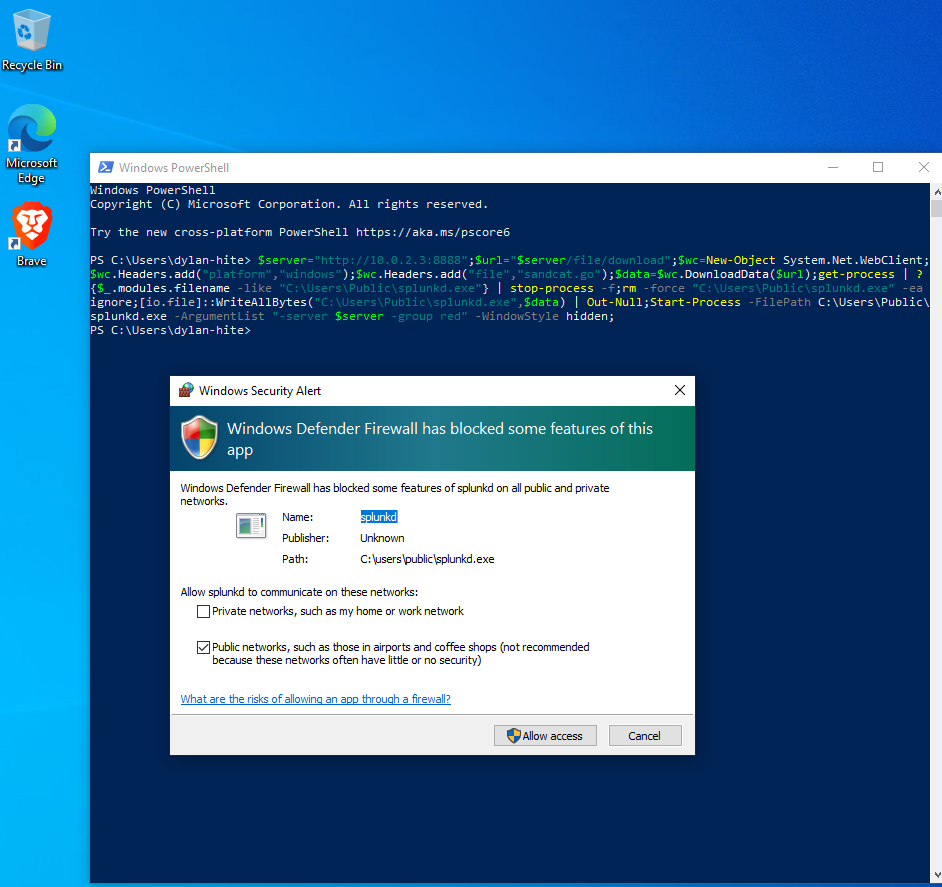
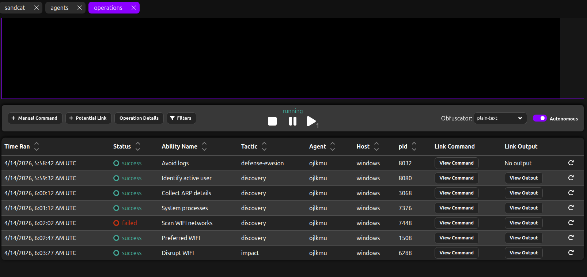
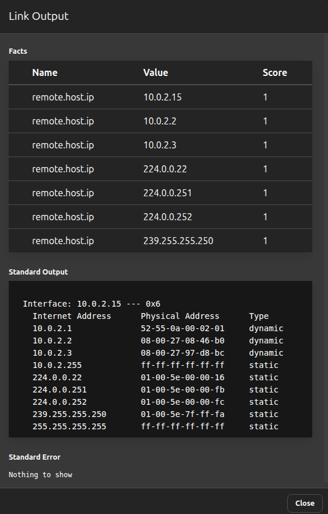

You can see that windows defender actually managed to block one of the probes which is interesting.

From here, the attacker has gained information about the target’s device, including active users, arp cache, etc.

### Documentation

Techniques observed:

* User discovery
* Process enumeration
* ARP/network discovery
* WiFi enumeration (partially blocked)

Mapped to MITRE ATT&CK:

* T1033 – Account Discovery
* T1057 – Process Discovery
* T1016 – Network Discovery

---

## Defensive Analysis

I’ll switch from attacker to victim and go into incident response mode. On the windows side I want to:

* identify running processes
* understand the tree that created any suspicious ones
* run netscan to identify active network connections
* kill processes
* block IP’s
* clean up

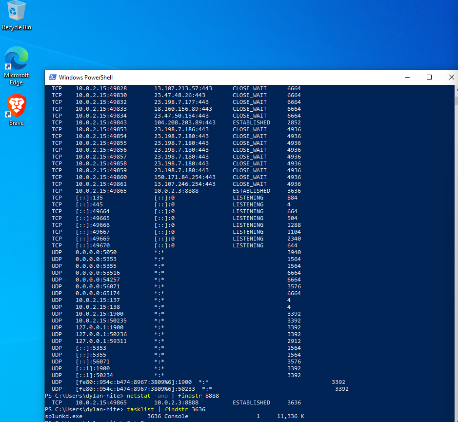
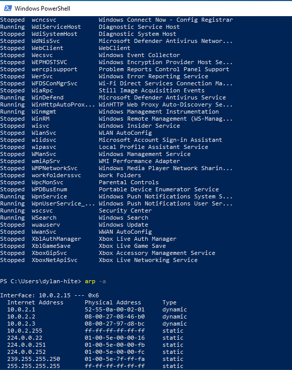
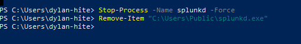

### Documentation

### Network Analysis

```powershell
netstat -ano | findstr 8888
```

* Identified connection to CALDERA server (`10.0.2.3:8888`)
* Associated PID: `3636`

---

### Process Correlation

```powershell
tasklist | findstr 3636
```

Result:

* `splunkd.exe`

Indicators:

* Running from `C:\Users\Public\`
* Masquerading as legitimate software

---

### ARP Analysis

```powershell
arp -a
```

* Confirmed discovery of local network hosts
* Matches adversary reconnaissance behavior

---

### Services Check

```powershell
Get-Service
```

* No persistence mechanisms found
* Confirms attack was reconnaissance-focused

---

## Cleanup

```powershell
Stop-Process -Name splunkd -Force
Remove-Item "C:\Users\Public\splunkd.exe"
```

### Documentation

* Terminated malicious process
* Removed agent binary
* Verified no active connections remained

---

## Final Thoughts

This was a good first attack and a solid introduction into adversary emulation. Most of this activity would blend in with normal traffic in a real environment, which is why detection and correlation become so important.


---
